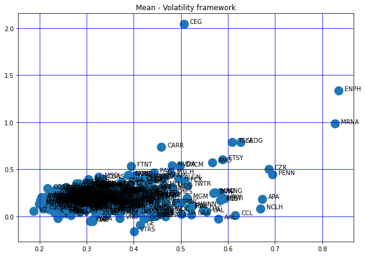
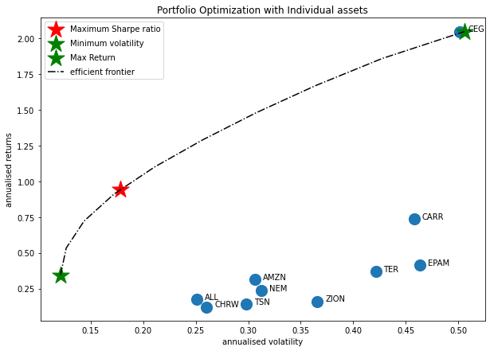
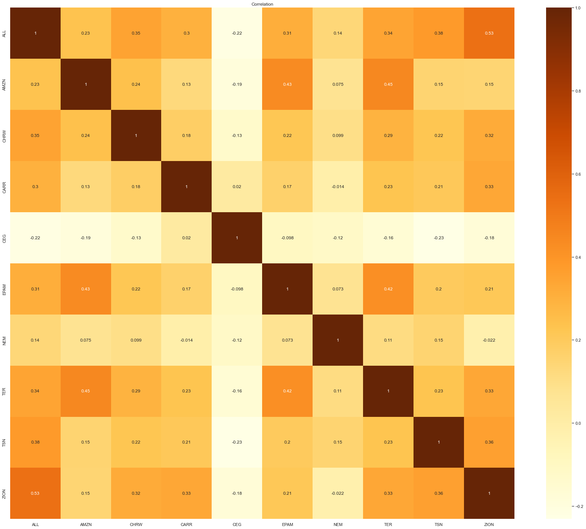
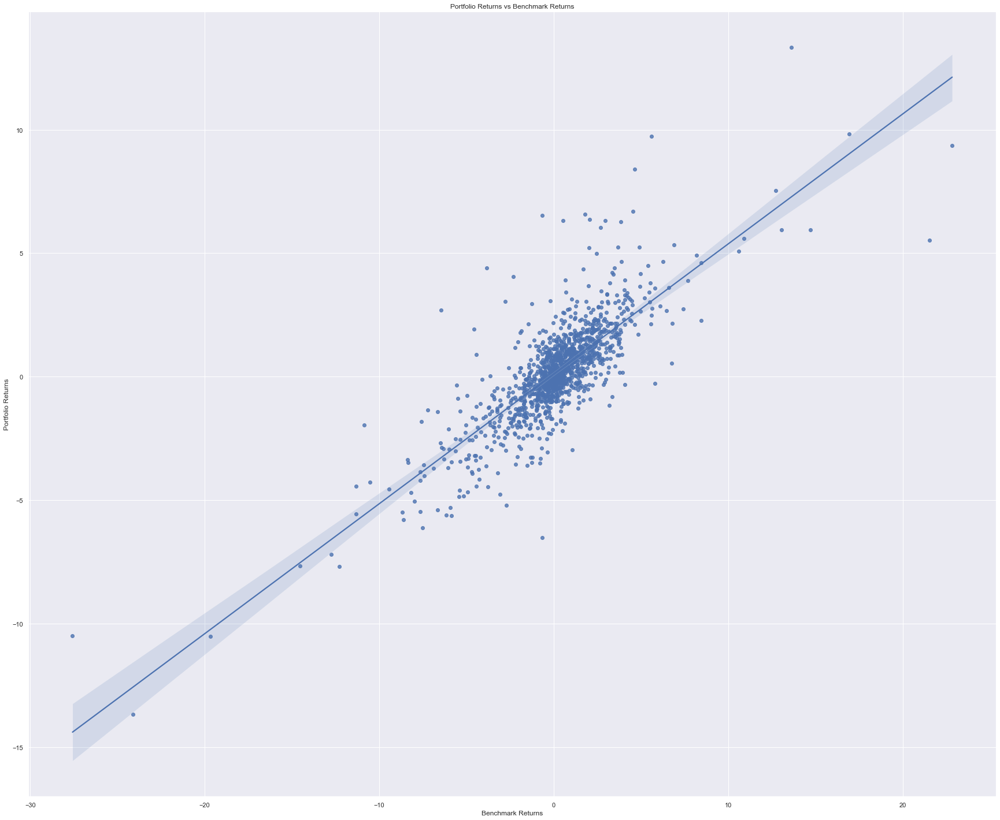
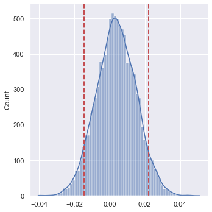

# Imports


```python
import pandas as pd
import numpy as np
import matplotlib.pyplot as plt
%matplotlib inline
from matplotlib.pyplot import figure
from datetime import datetime
import pandas_datareader.data as web
import scipy.optimize as sco
from scipy import stats
import scipy.stats as stats
import seaborn as sns
from yahoo_fin.stock_info import get_data
from sklearn.linear_model import LinearRegression
from statsmodels.api import OLS
from progressbar import ProgressBar
```

### Show code on/off

from IPython.display import HTML

HTML('''<script>
code_show=true; 
function code_toggle() {
 if (code_show){
 $('div.input').hide();
 } else {
 $('div.input').show();
 }
 code_show = !code_show
} 
$( document ).ready(code_toggle);
</script>
<form action="javascript:code_toggle()"><input type="submit" value="Click here to toggle on/off the raw code."></form>''')

# Data collection


```python
def ImportDataClose(name, start, end, interval):
    n = len(name)
    ptf = pd.DataFrame()
    pbar = ProgressBar()
    errors = []
    for i in pbar(range(n)):
        try:
            tmp = pd.DataFrame(get_data(name[i], start, end, index_as_date = True, interval = interval)["adjclose"])
            tmp.rename(columns = {'adjclose':name[i]}, inplace = True)
            ptf = pd.concat([ptf, tmp], axis = 1)
        except:
            #print("error with :", name[i])
            errors.append(name[i])
            pass
    #ptf.columns = name
    return(ptf,errors)
```


```python
payload=pd.read_html('https://en.wikipedia.org/wiki/List_of_S%26P_500_companies')
first_table = payload[0]
second_table = payload[1]
snp500 = first_table
snp500 = snp500['Symbol'].values.tolist()
len(snp500)
```


    504


```python
assets = snp500
```


```python
start = datetime(2017,1,1)
end = datetime(2022,4,10)
temp_data, errors = ImportDataClose(assets, start, end, "1d")
assets = [tick for tick in assets if tick not in errors]
temp_data
```

    100% |########################################################################|
    


<div>
<style scoped>
    .dataframe tbody tr th:only-of-type {
        vertical-align: middle;
    }

    .dataframe tbody tr th {
        vertical-align: top;
    }

    .dataframe thead th {
        text-align: right;
    }
</style>
<table border="1" class="dataframe">
  <thead>
    <tr style="text-align: right;">
      <th></th>
      <th>MMM</th>
      <th>AOS</th>
      <th>ABT</th>
      <th>ABBV</th>
      <th>ABMD</th>
      <th>ACN</th>
      <th>ATVI</th>
      <th>ADM</th>
      <th>ADBE</th>
      <th>ADP</th>
      <th>...</th>
      <th>WMB</th>
      <th>WTW</th>
      <th>WYNN</th>
      <th>XEL</th>
      <th>XYL</th>
      <th>YUM</th>
      <th>ZBRA</th>
      <th>ZBH</th>
      <th>ZION</th>
      <th>ZTS</th>
    </tr>
  </thead>
  <tbody>
    <tr>
      <th>2017-01-03</th>
      <td>151.730133</td>
      <td>43.674175</td>
      <td>35.474602</td>
      <td>48.673820</td>
      <td>112.360001</td>
      <td>107.060616</td>
      <td>35.324673</td>
      <td>39.477703</td>
      <td>103.480003</td>
      <td>92.627014</td>
      <td>...</td>
      <td>23.357040</td>
      <td>123.239998</td>
      <td>81.032707</td>
      <td>35.631283</td>
      <td>46.610390</td>
      <td>57.689140</td>
      <td>86.250000</td>
      <td>96.441597</td>
      <td>38.806141</td>
      <td>51.887024</td>
    </tr>
    <tr>
      <th>2017-01-04</th>
      <td>151.960175</td>
      <td>44.060326</td>
      <td>35.756222</td>
      <td>49.360134</td>
      <td>115.739998</td>
      <td>107.318024</td>
      <td>36.018829</td>
      <td>39.409328</td>
      <td>104.139999</td>
      <td>92.770210</td>
      <td>...</td>
      <td>23.282795</td>
      <td>124.760002</td>
      <td>83.645470</td>
      <td>35.789192</td>
      <td>47.305088</td>
      <td>57.899048</td>
      <td>87.029999</td>
      <td>97.328262</td>
      <td>39.363338</td>
      <td>52.390507</td>
    </tr>
    <tr>
      <th>2017-01-05</th>
      <td>151.440384</td>
      <td>43.858044</td>
      <td>36.065090</td>
      <td>49.734486</td>
      <td>114.809998</td>
      <td>105.709259</td>
      <td>36.578007</td>
      <td>39.118755</td>
      <td>105.910004</td>
      <td>92.215324</td>
      <td>...</td>
      <td>23.564928</td>
      <td>125.959999</td>
      <td>84.720230</td>
      <td>35.789192</td>
      <td>46.873249</td>
      <td>58.090710</td>
      <td>84.750000</td>
      <td>97.953606</td>
      <td>38.725262</td>
      <td>52.216228</td>
    </tr>
    <tr>
      <th>2017-01-06</th>
      <td>151.883499</td>
      <td>43.876446</td>
      <td>37.046207</td>
      <td>49.750088</td>
      <td>115.419998</td>
      <td>106.913536</td>
      <td>36.549084</td>
      <td>38.221329</td>
      <td>108.300003</td>
      <td>92.277992</td>
      <td>...</td>
      <td>24.069778</td>
      <td>126.779999</td>
      <td>85.637459</td>
      <td>35.894444</td>
      <td>46.544678</td>
      <td>58.793453</td>
      <td>85.959999</td>
      <td>97.962944</td>
      <td>38.976894</td>
      <td>52.380821</td>
    </tr>
    <tr>
      <th>2017-01-09</th>
      <td>151.065445</td>
      <td>43.582218</td>
      <td>37.009861</td>
      <td>50.077652</td>
      <td>117.110001</td>
      <td>105.718445</td>
      <td>36.346622</td>
      <td>38.246971</td>
      <td>108.570000</td>
      <td>91.705223</td>
      <td>...</td>
      <td>23.705990</td>
      <td>126.010002</td>
      <td>85.933945</td>
      <td>35.350582</td>
      <td>46.347530</td>
      <td>58.957729</td>
      <td>85.970001</td>
      <td>99.866936</td>
      <td>38.554516</td>
      <td>52.235600</td>
    </tr>
    <tr>
      <th>...</th>
      <td>...</td>
      <td>...</td>
      <td>...</td>
      <td>...</td>
      <td>...</td>
      <td>...</td>
      <td>...</td>
      <td>...</td>
      <td>...</td>
      <td>...</td>
      <td>...</td>
      <td>...</td>
      <td>...</td>
      <td>...</td>
      <td>...</td>
      <td>...</td>
      <td>...</td>
      <td>...</td>
      <td>...</td>
      <td>...</td>
      <td>...</td>
    </tr>
    <tr>
      <th>2022-04-04</th>
      <td>149.529999</td>
      <td>67.059998</td>
      <td>118.408058</td>
      <td>160.525681</td>
      <td>325.700012</td>
      <td>343.447357</td>
      <td>80.252975</td>
      <td>90.430000</td>
      <td>468.809998</td>
      <td>235.179993</td>
      <td>...</td>
      <td>33.730000</td>
      <td>238.309998</td>
      <td>81.839996</td>
      <td>72.699997</td>
      <td>86.760002</td>
      <td>117.699997</td>
      <td>431.239990</td>
      <td>125.860001</td>
      <td>64.099998</td>
      <td>188.740005</td>
    </tr>
    <tr>
      <th>2022-04-05</th>
      <td>148.899994</td>
      <td>65.389999</td>
      <td>119.005676</td>
      <td>162.052689</td>
      <td>322.660004</td>
      <td>341.802246</td>
      <td>79.905037</td>
      <td>90.900002</td>
      <td>458.579987</td>
      <td>238.000000</td>
      <td>...</td>
      <td>32.980000</td>
      <td>239.460007</td>
      <td>79.070000</td>
      <td>73.070000</td>
      <td>86.889999</td>
      <td>117.639999</td>
      <td>423.720001</td>
      <td>129.130005</td>
      <td>64.400002</td>
      <td>188.399994</td>
    </tr>
    <tr>
      <th>2022-04-06</th>
      <td>150.300003</td>
      <td>64.599998</td>
      <td>119.463852</td>
      <td>167.486526</td>
      <td>313.760010</td>
      <td>339.249847</td>
      <td>79.636635</td>
      <td>92.830002</td>
      <td>444.329987</td>
      <td>237.789993</td>
      <td>...</td>
      <td>33.400002</td>
      <td>239.449997</td>
      <td>76.169998</td>
      <td>74.989998</td>
      <td>86.709999</td>
      <td>118.620003</td>
      <td>422.899994</td>
      <td>127.849998</td>
      <td>63.669998</td>
      <td>191.380005</td>
    </tr>
    <tr>
      <th>2022-04-07</th>
      <td>149.949997</td>
      <td>63.330002</td>
      <td>122.880234</td>
      <td>171.819687</td>
      <td>317.519989</td>
      <td>340.755341</td>
      <td>79.636635</td>
      <td>93.980003</td>
      <td>452.720001</td>
      <td>238.500000</td>
      <td>...</td>
      <td>33.650002</td>
      <td>240.410004</td>
      <td>73.970001</td>
      <td>74.570000</td>
      <td>86.720001</td>
      <td>120.400002</td>
      <td>418.399994</td>
      <td>129.910004</td>
      <td>63.180000</td>
      <td>197.929993</td>
    </tr>
    <tr>
      <th>2022-04-08</th>
      <td>149.809998</td>
      <td>62.869999</td>
      <td>122.760712</td>
      <td>173.485535</td>
      <td>314.529999</td>
      <td>337.913818</td>
      <td>79.616745</td>
      <td>95.250000</td>
      <td>445.339996</td>
      <td>237.710007</td>
      <td>...</td>
      <td>34.419998</td>
      <td>241.050003</td>
      <td>72.230003</td>
      <td>74.820000</td>
      <td>86.669998</td>
      <td>119.169998</td>
      <td>415.630005</td>
      <td>129.619995</td>
      <td>63.889999</td>
      <td>200.089996</td>
    </tr>
  </tbody>
</table>
<p>1327 rows × 502 columns</p>
</div>


```python
errors
```


    ['BRK.B', 'BF.B']


```python
data = temp_data
```


```python
pd.DataFrame(data.isnull().sum()).loc[~(pd.DataFrame(data.isnull().sum())==0).all(axis=1)]
```


<div>
<style scoped>
    .dataframe tbody tr th:only-of-type {
        vertical-align: middle;
    }

    .dataframe tbody tr th {
        vertical-align: top;
    }

    .dataframe thead th {
        text-align: right;
    }
</style>
<table border="1" class="dataframe">
  <thead>
    <tr style="text-align: right;">
      <th></th>
      <th>0</th>
    </tr>
  </thead>
  <tbody>
    <tr>
      <th>CARR</th>
      <td>807</td>
    </tr>
    <tr>
      <th>CDAY</th>
      <td>330</td>
    </tr>
    <tr>
      <th>CEG</th>
      <td>1270</td>
    </tr>
    <tr>
      <th>CTVA</th>
      <td>601</td>
    </tr>
    <tr>
      <th>DOW</th>
      <td>555</td>
    </tr>
    <tr>
      <th>FOXA</th>
      <td>549</td>
    </tr>
    <tr>
      <th>FOX</th>
      <td>550</td>
    </tr>
    <tr>
      <th>IR</th>
      <td>90</td>
    </tr>
    <tr>
      <th>MRNA</th>
      <td>486</td>
    </tr>
    <tr>
      <th>OGN</th>
      <td>1098</td>
    </tr>
    <tr>
      <th>OTIS</th>
      <td>807</td>
    </tr>
  </tbody>
</table>
</div>


# Descriptive statistics

###### Returns


```python
data_returns = data.pct_change()
data_returns = data_returns.iloc[1: , :]
print("There are", data_returns.isnull().sum().sum(),"missing data")
```

    There are 7143 missing data
    

###### Daily stats


```python
data_returns.describe()
```


<div>
<style scoped>
    .dataframe tbody tr th:only-of-type {
        vertical-align: middle;
    }

    .dataframe tbody tr th {
        vertical-align: top;
    }

    .dataframe thead th {
        text-align: right;
    }
</style>
<table border="1" class="dataframe">
  <thead>
    <tr style="text-align: right;">
      <th></th>
      <th>MMM</th>
      <th>AOS</th>
      <th>ABT</th>
      <th>ABBV</th>
      <th>ABMD</th>
      <th>ACN</th>
      <th>ATVI</th>
      <th>ADM</th>
      <th>ADBE</th>
      <th>ADP</th>
      <th>...</th>
      <th>WMB</th>
      <th>WTW</th>
      <th>WYNN</th>
      <th>XEL</th>
      <th>XYL</th>
      <th>YUM</th>
      <th>ZBRA</th>
      <th>ZBH</th>
      <th>ZION</th>
      <th>ZTS</th>
    </tr>
  </thead>
  <tbody>
    <tr>
      <th>count</th>
      <td>1326.000000</td>
      <td>1326.000000</td>
      <td>1326.000000</td>
      <td>1326.000000</td>
      <td>1326.000000</td>
      <td>1326.000000</td>
      <td>1326.000000</td>
      <td>1326.000000</td>
      <td>1326.000000</td>
      <td>1326.000000</td>
      <td>...</td>
      <td>1326.000000</td>
      <td>1326.000000</td>
      <td>1326.000000</td>
      <td>1326.000000</td>
      <td>1326.000000</td>
      <td>1326.000000</td>
      <td>1326.000000</td>
      <td>1326.000000</td>
      <td>1326.000000</td>
      <td>1326.000000</td>
    </tr>
    <tr>
      <th>mean</th>
      <td>0.000114</td>
      <td>0.000425</td>
      <td>0.001059</td>
      <td>0.001111</td>
      <td>0.001137</td>
      <td>0.000994</td>
      <td>0.000867</td>
      <td>0.000791</td>
      <td>0.001329</td>
      <td>0.000854</td>
      <td>...</td>
      <td>0.000532</td>
      <td>0.000635</td>
      <td>0.000459</td>
      <td>0.000659</td>
      <td>0.000636</td>
      <td>0.000668</td>
      <td>0.001462</td>
      <td>0.000402</td>
      <td>0.000639</td>
      <td>0.001145</td>
    </tr>
    <tr>
      <th>std</th>
      <td>0.015645</td>
      <td>0.017367</td>
      <td>0.015664</td>
      <td>0.017327</td>
      <td>0.026509</td>
      <td>0.015957</td>
      <td>0.022674</td>
      <td>0.015872</td>
      <td>0.021339</td>
      <td>0.016858</td>
      <td>...</td>
      <td>0.021746</td>
      <td>0.016050</td>
      <td>0.033030</td>
      <td>0.014053</td>
      <td>0.018287</td>
      <td>0.015708</td>
      <td>0.023561</td>
      <td>0.018997</td>
      <td>0.023062</td>
      <td>0.015903</td>
    </tr>
    <tr>
      <th>min</th>
      <td>-0.129451</td>
      <td>-0.086694</td>
      <td>-0.097857</td>
      <td>-0.162524</td>
      <td>-0.264539</td>
      <td>-0.083899</td>
      <td>-0.140595</td>
      <td>-0.100656</td>
      <td>-0.147452</td>
      <td>-0.152526</td>
      <td>...</td>
      <td>-0.237428</td>
      <td>-0.092248</td>
      <td>-0.244346</td>
      <td>-0.126919</td>
      <td>-0.120273</td>
      <td>-0.109992</td>
      <td>-0.155724</td>
      <td>-0.113277</td>
      <td>-0.120465</td>
      <td>-0.146956</td>
    </tr>
    <tr>
      <th>25%</th>
      <td>-0.006162</td>
      <td>-0.008281</td>
      <td>-0.005706</td>
      <td>-0.006804</td>
      <td>-0.009819</td>
      <td>-0.005522</td>
      <td>-0.009774</td>
      <td>-0.006632</td>
      <td>-0.006722</td>
      <td>-0.005964</td>
      <td>...</td>
      <td>-0.008825</td>
      <td>-0.006213</td>
      <td>-0.014519</td>
      <td>-0.005572</td>
      <td>-0.007285</td>
      <td>-0.005216</td>
      <td>-0.009763</td>
      <td>-0.007685</td>
      <td>-0.011236</td>
      <td>-0.005892</td>
    </tr>
    <tr>
      <th>50%</th>
      <td>0.000627</td>
      <td>0.000865</td>
      <td>0.001226</td>
      <td>0.001571</td>
      <td>0.001784</td>
      <td>0.001706</td>
      <td>0.001409</td>
      <td>0.001197</td>
      <td>0.002187</td>
      <td>0.001534</td>
      <td>...</td>
      <td>0.000414</td>
      <td>0.000904</td>
      <td>-0.000318</td>
      <td>0.000878</td>
      <td>0.000897</td>
      <td>0.000768</td>
      <td>0.000924</td>
      <td>0.000314</td>
      <td>0.000554</td>
      <td>0.001528</td>
    </tr>
    <tr>
      <th>75%</th>
      <td>0.007621</td>
      <td>0.009314</td>
      <td>0.009250</td>
      <td>0.008989</td>
      <td>0.014762</td>
      <td>0.008306</td>
      <td>0.011750</td>
      <td>0.008700</td>
      <td>0.011222</td>
      <td>0.008727</td>
      <td>...</td>
      <td>0.009485</td>
      <td>0.007641</td>
      <td>0.014820</td>
      <td>0.007112</td>
      <td>0.009517</td>
      <td>0.006929</td>
      <td>0.012367</td>
      <td>0.008884</td>
      <td>0.011971</td>
      <td>0.008953</td>
    </tr>
    <tr>
      <th>max</th>
      <td>0.125986</td>
      <td>0.105049</td>
      <td>0.109360</td>
      <td>0.137673</td>
      <td>0.141993</td>
      <td>0.128573</td>
      <td>0.258755</td>
      <td>0.102695</td>
      <td>0.177193</td>
      <td>0.118035</td>
      <td>...</td>
      <td>0.189616</td>
      <td>0.151057</td>
      <td>0.276883</td>
      <td>0.112577</td>
      <td>0.112620</td>
      <td>0.232484</td>
      <td>0.172142</td>
      <td>0.155798</td>
      <td>0.238811</td>
      <td>0.119793</td>
    </tr>
  </tbody>
</table>
<p>8 rows × 502 columns</p>
</div>


###### Annualized stats


```python
stats = np.array([data_returns.std()*np.sqrt(252),data_returns.mean()*252])
desc = pd.DataFrame(stats, columns = assets, index = ["Stdev","Returns"])
desc
```


<div>
<style scoped>
    .dataframe tbody tr th:only-of-type {
        vertical-align: middle;
    }

    .dataframe tbody tr th {
        vertical-align: top;
    }

    .dataframe thead th {
        text-align: right;
    }
</style>
<table border="1" class="dataframe">
  <thead>
    <tr style="text-align: right;">
      <th></th>
      <th>MMM</th>
      <th>AOS</th>
      <th>ABT</th>
      <th>ABBV</th>
      <th>ABMD</th>
      <th>ACN</th>
      <th>ATVI</th>
      <th>ADM</th>
      <th>ADBE</th>
      <th>ADP</th>
      <th>...</th>
      <th>WMB</th>
      <th>WTW</th>
      <th>WYNN</th>
      <th>XEL</th>
      <th>XYL</th>
      <th>YUM</th>
      <th>ZBRA</th>
      <th>ZBH</th>
      <th>ZION</th>
      <th>ZTS</th>
    </tr>
  </thead>
  <tbody>
    <tr>
      <th>Stdev</th>
      <td>0.248355</td>
      <td>0.275691</td>
      <td>0.248658</td>
      <td>0.275062</td>
      <td>0.420816</td>
      <td>0.253316</td>
      <td>0.359942</td>
      <td>0.251965</td>
      <td>0.338751</td>
      <td>0.267611</td>
      <td>...</td>
      <td>0.345202</td>
      <td>0.254781</td>
      <td>0.524342</td>
      <td>0.223083</td>
      <td>0.290295</td>
      <td>0.249362</td>
      <td>0.374012</td>
      <td>0.301569</td>
      <td>0.366091</td>
      <td>0.252457</td>
    </tr>
    <tr>
      <th>Returns</th>
      <td>0.028624</td>
      <td>0.107205</td>
      <td>0.266938</td>
      <td>0.279867</td>
      <td>0.286539</td>
      <td>0.250504</td>
      <td>0.218503</td>
      <td>0.199246</td>
      <td>0.334869</td>
      <td>0.215204</td>
      <td>...</td>
      <td>0.133973</td>
      <td>0.159947</td>
      <td>0.115682</td>
      <td>0.166033</td>
      <td>0.160161</td>
      <td>0.168439</td>
      <td>0.368382</td>
      <td>0.101430</td>
      <td>0.161084</td>
      <td>0.288553</td>
    </tr>
  </tbody>
</table>
<p>2 rows × 502 columns</p>
</div>


###### Correlation matrix


```python
cov_matrix = data_returns.corr()
```

sns.set(rc = {'figure.figsize':(30,25)})
sns.heatmap(cov_matrix.round(3),annot=True,cmap='YlOrBr').set_title('Correlation')

###### Mean-Variance framework


```python
fig, ax = plt.subplots(figsize=(10, 7))
plt.grid()

ax.scatter(stats[0],stats[1],marker='o',s=200)
#To start graph at 0,0
#ax.set_ylim(ymin=0)
#ax.set_xlim(xmin=0)
ax.grid( which='major', color='b', linestyle='-')
plt.title("Mean - Volatility framework")

for i, txt in enumerate(assets):
    ax.annotate(txt, (stats[0][i] ,stats[1][i]), xytext=(10,0), textcoords='offset points')
```


    

    


# Optimal portfolio with optimization

##### Our portfolio


```python
initial_inv = 100000
```


```python
mean_returns = data_returns.mean()
cov_matrix = data_returns.cov()
assets_num = len(assets)
trading_days = len(data)
```


```python
risk_free_rate = 0.0027
```

###### Individual portfolio performance given weights


```python
def portfolio_annualised_performance(weights, mean_returns, cov_matrix):
    returns = np.sum(mean_returns*weights ) *252
    std = np.sqrt(np.dot(weights.T, np.dot(cov_matrix, weights))) * np.sqrt(252)
    return std, returns
```

###### Max sharpe


```python
def neg_sharpe_ratio(weights, mean_returns, cov_matrix, risk_free_rate):
    p_var, p_ret = portfolio_annualised_performance(weights, mean_returns, cov_matrix)
    return -(p_ret - risk_free_rate) / p_var

def max_sharpe_ratio(mean_returns, cov_matrix, risk_free_rate):
    num_assets = len(mean_returns)
    args = (mean_returns, cov_matrix, risk_free_rate)
    constraints = ({'type': 'eq', 'fun': lambda x: np.sum(x) - 1})
    bound = (0.0,1.0)
    bounds = tuple(bound for asset in range(num_assets))
    result = sco.minimize(neg_sharpe_ratio, num_assets*[1./num_assets,], args=args,
                        method='SLSQP', bounds=bounds, constraints=constraints)
    return result
```

###### Max return


```python
mrp_arg = stats[1].argmax()
mrp = np.array([stats[0][mrp_arg],stats[1][mrp_arg]])
```

###### Min stdev


```python
def portfolio_volatility(weights, mean_returns, cov_matrix):
    return portfolio_annualised_performance(weights, mean_returns, cov_matrix)[0]

def min_variance(mean_returns, cov_matrix):
    num_assets = len(mean_returns)
    args = (mean_returns, cov_matrix)
    constraints = ({'type': 'eq', 'fun': lambda x: np.sum(x) - 1})
    bound = (0.0,1.0)
    bounds = tuple(bound for asset in range(num_assets))

    result = sco.minimize(portfolio_volatility, num_assets*[1./num_assets,], args=args,
                        method='SLSQP', bounds=bounds, constraints=constraints)

    return result
```

###### Efficient frontier


```python
def efficient_return(mean_returns, cov_matrix, target):
    
    num_assets = len(mean_returns)
    args = (mean_returns, cov_matrix)

    def portfolio_return(weights):
        return portfolio_annualised_performance(weights, mean_returns, cov_matrix)[1]

    constraints = ({'type': 'eq', 'fun': lambda x: portfolio_return(x) - target}, 
                   {'type': 'eq', 'fun': lambda x: np.sum(x) - 1} #Sum of weights equal to 1
                  )
    
    bounds = tuple((0.0,1.0) for asset in range(num_assets))
    
    
    result = sco.minimize(portfolio_volatility, #fonction a minimize, compute and return stdev given weights
                          num_assets*[1./num_assets,], #Initial guess, naive portfolio, 1/num_assets
                          args=args, #Other arguments that the function take that we don't optimize
                          method='SLSQP', #method
                          bounds=bounds, #Bonds each weights to a tuple (0,1)
                          constraints=constraints #Explained above
                         )
    
    
    return result


def efficient_frontier(mean_returns, cov_matrix, returns_range):
    efficients = []
    for ret in returns_range:
        efficients.append(efficient_return(mean_returns, cov_matrix, ret))
    return efficients
```

# Display final efficient frontier


```python
max_sharpe = max_sharpe_ratio(mean_returns, cov_matrix, risk_free_rate)
sdp, rp = portfolio_annualised_performance(max_sharpe['x'], mean_returns, cov_matrix)
max_sharpe_allocation = pd.DataFrame(max_sharpe.x,index=assets,columns=['allocation'])
max_sharpe_allocation.allocation = [round(i*100,2)for i in max_sharpe_allocation.allocation]
max_sharpe_allocation = max_sharpe_allocation.T
max_sharpe_allocation = max_sharpe_allocation.loc[:, (max_sharpe_allocation != 0).any(axis=0)]
max_sharpe_assets = list(max_sharpe_allocation.columns)

min_vol = min_variance(mean_returns, cov_matrix)
sdp_min, rp_min = portfolio_annualised_performance(min_vol['x'], mean_returns, cov_matrix)
min_vol_allocation = pd.DataFrame(min_vol.x,index=assets,columns=['allocation'])
min_vol_allocation.allocation = [round(i*100,2)for i in min_vol_allocation.allocation]
min_vol_allocation = min_vol_allocation.T
min_vol_allocation = min_vol_allocation.loc[:, (min_vol_allocation != 0).any(axis=0)]

an_vol = np.std(data_returns) * np.sqrt(252)
an_rt = mean_returns * 252
```


```python
print ("-"*80)
print ("Maximum Sharpe Ratio Portfolio Allocation\n")
print ("Annualised Return:", round(rp,2))
print ("Annualised Volatility:", round(sdp,2))
print ("\n")
print (max_sharpe_allocation)
print ("-"*80)
print ("Minimum Volatility Portfolio Allocation\n")
print ("Annualised Return:", round(rp_min,2))
print ("Annualised Volatility:", round(sdp_min,2))
print ("\n")
print (min_vol_allocation)
print ("-"*80)


fig, ax = plt.subplots(figsize=(10, 7))
ax.scatter(an_vol[max_sharpe_assets],an_rt[max_sharpe_assets],marker='o',s=200)

for i, txt in enumerate(max_sharpe_assets):
    ax.annotate(txt, (an_vol[max_sharpe_assets][i],an_rt[max_sharpe_assets][i]), xytext=(10,0), textcoords='offset points')

ax.scatter(sdp,rp,marker='*',color='r',s=500, label='Maximum Sharpe ratio')
ax.scatter(sdp_min,rp_min,marker='*',color='g',s=500, label='Minimum volatility')
#ax.scatter(actual_portfolio[0], actual_portfolio[1] , marker='*',color='y',s=500, label='Actual portfolio')
ax.scatter(mrp[0], mrp[1] , marker='*',color='g',s=500, label='Max Return')

target = np.linspace(rp_min, mrp[1], 10)
efficient_portfolios = efficient_frontier(mean_returns, cov_matrix, target)

ax.plot([p['fun'] for p in efficient_portfolios], target, linestyle='-.', color='black', label='efficient frontier')
ax.set_title('Portfolio Optimization with Individual assets')
ax.set_xlabel('annualised volatility')
ax.set_ylabel('annualised returns')
ax.legend(labelspacing=0.8)
```

    --------------------------------------------------------------------------------
    Maximum Sharpe Ratio Portfolio Allocation
    
    Annualised Return: 0.94
    Annualised Volatility: 0.18
    
    
                ALL   AMZN  CHRW  CARR    CEG  EPAM    NEM   TER   TSN  ZION
    allocation  0.8  18.39  3.64  4.14  36.84  8.45  12.05  3.28  9.21   3.2
    --------------------------------------------------------------------------------
    Minimum Volatility Portfolio Allocation
    
    Annualised Return: 0.34
    Annualised Volatility: 0.12
    
    
                AMZN   AON   BMY  CHRW   CPB  CTXS   CLX    KO    CEG    DG  ...  \
    allocation  7.09  2.52  3.06  8.41  3.85  4.16  2.19  2.25  10.25  0.09  ...   
    
                 NEM  NLOK   OGN  PSA   SJM   TSN    VZ  VTRS   WMT  ZION  
    allocation  9.86  2.74  2.52  0.1  2.78  5.42  6.86  1.32  0.97  0.73  
    
    [1 rows x 27 columns]
    --------------------------------------------------------------------------------
    


    <matplotlib.legend.Legend at 0x2a6bce481f0>


    

    


```python
sns.set(rc = {'figure.figsize':(30,25)})
sns.heatmap(data_returns[max_sharpe_allocation.columns].corr().round(3),annot=True,cmap='YlOrBr').set_title('Correlation')
```


    Text(0.5, 1.0, 'Correlation')


    

    


```python
capital = 100000
```


```python
alloc = pd.DataFrame(max_sharpe_allocation.T)
alloc = alloc.replace(0,np.nan).dropna(axis=1,how="all")
alloc = alloc.dropna()
alloc = alloc.sort_index()
alloc = alloc.reset_index()


for index, row in alloc.iterrows():
    if row['allocation'] < 0:
        alloc.drop(index, inplace=True)

alloc['alloc_pct'] = alloc.allocation / alloc.allocation.sum()
alloc['alloc_pct'] = alloc['alloc_pct']
alloc['port_pct'] = alloc.alloc_pct *1


price = []
for index, row in alloc.iterrows():
    #print(row["index"],data[row["index"]].iloc[-1])
    price.append(data[row["index"]].iloc[-1])
alloc["price"] = price


alloc["p/u"] = (alloc["port_pct"] * capital) / alloc["price"]
alloc['date'] = data.index[-1]
alloc
```


<div>
<style scoped>
    .dataframe tbody tr th:only-of-type {
        vertical-align: middle;
    }

    .dataframe tbody tr th {
        vertical-align: top;
    }

    .dataframe thead th {
        text-align: right;
    }
</style>
<table border="1" class="dataframe">
  <thead>
    <tr style="text-align: right;">
      <th></th>
      <th>index</th>
      <th>allocation</th>
      <th>alloc_pct</th>
      <th>port_pct</th>
      <th>price</th>
      <th>p/u</th>
      <th>date</th>
    </tr>
  </thead>
  <tbody>
    <tr>
      <th>0</th>
      <td>ALL</td>
      <td>0.80</td>
      <td>0.0080</td>
      <td>0.0080</td>
      <td>141.929993</td>
      <td>5.636582</td>
      <td>2022-04-08</td>
    </tr>
    <tr>
      <th>1</th>
      <td>AMZN</td>
      <td>18.39</td>
      <td>0.1839</td>
      <td>0.1839</td>
      <td>3089.209961</td>
      <td>5.952978</td>
      <td>2022-04-08</td>
    </tr>
    <tr>
      <th>2</th>
      <td>CARR</td>
      <td>4.14</td>
      <td>0.0414</td>
      <td>0.0414</td>
      <td>43.380001</td>
      <td>95.435682</td>
      <td>2022-04-08</td>
    </tr>
    <tr>
      <th>3</th>
      <td>CEG</td>
      <td>36.84</td>
      <td>0.3684</td>
      <td>0.3684</td>
      <td>64.019997</td>
      <td>575.445204</td>
      <td>2022-04-08</td>
    </tr>
    <tr>
      <th>4</th>
      <td>CHRW</td>
      <td>3.64</td>
      <td>0.0364</td>
      <td>0.0364</td>
      <td>102.040001</td>
      <td>35.672285</td>
      <td>2022-04-08</td>
    </tr>
    <tr>
      <th>5</th>
      <td>EPAM</td>
      <td>8.45</td>
      <td>0.0845</td>
      <td>0.0845</td>
      <td>308.690002</td>
      <td>27.373740</td>
      <td>2022-04-08</td>
    </tr>
    <tr>
      <th>6</th>
      <td>NEM</td>
      <td>12.05</td>
      <td>0.1205</td>
      <td>0.1205</td>
      <td>82.120003</td>
      <td>146.736478</td>
      <td>2022-04-08</td>
    </tr>
    <tr>
      <th>7</th>
      <td>TER</td>
      <td>3.28</td>
      <td>0.0328</td>
      <td>0.0328</td>
      <td>108.660004</td>
      <td>30.185900</td>
      <td>2022-04-08</td>
    </tr>
    <tr>
      <th>8</th>
      <td>TSN</td>
      <td>9.21</td>
      <td>0.0921</td>
      <td>0.0921</td>
      <td>92.440002</td>
      <td>99.632191</td>
      <td>2022-04-08</td>
    </tr>
    <tr>
      <th>9</th>
      <td>ZION</td>
      <td>3.20</td>
      <td>0.0320</td>
      <td>0.0320</td>
      <td>63.889999</td>
      <td>50.086086</td>
      <td>2022-04-08</td>
    </tr>
  </tbody>
</table>
</div>


# Beta


```python
port_ret = data_returns[max_sharpe_assets].mul(max_sharpe_allocation.values/100, axis=1).sum(axis = 1)
port_ret = pd.DataFrame(port_ret)
```


```python
bench = ImportDataClose(["SPY"], start, end,"1d")
bench = bench[0]
bench_ret = bench.pct_change()
bench_ret = bench_ret.dropna()
```

    100% |########################################################################|
    


```python
port_ret = np.array(port_ret).reshape(-1, 1)
bench_ret = np.array(bench_ret)
port_ret = port_ret*252
bench_ret = bench_ret *252
#print(port_ret.shape)
#print(bench_ret.shape)
```


```python
print(OLS(port_ret,bench_ret).fit().summary())
```

                                     OLS Regression Results                                
    =======================================================================================
    Dep. Variable:                      y   R-squared (uncentered):                   0.646
    Model:                            OLS   Adj. R-squared (uncentered):              0.646
    Method:                 Least Squares   F-statistic:                              2420.
    Date:                Mon, 18 Apr 2022   Prob (F-statistic):                   3.12e-301
    Time:                        16:04:39   Log-Likelihood:                         -2099.7
    No. Observations:                1326   AIC:                                      4201.
    Df Residuals:                    1325   BIC:                                      4206.
    Df Model:                           1                                                  
    Covariance Type:            nonrobust                                                  
    ==============================================================================
                     coef    std err          t      P>|t|      [0.025      0.975]
    ------------------------------------------------------------------------------
    x1             0.5284      0.011     49.193      0.000       0.507       0.549
    ==============================================================================
    Omnibus:                      338.355   Durbin-Watson:                   1.956
    Prob(Omnibus):                  0.000   Jarque-Bera (JB):             2561.610
    Skew:                           0.971   Prob(JB):                         0.00
    Kurtosis:                       9.526   Cond. No.                         1.00
    ==============================================================================
    
    Notes:
    [1] R² is computed without centering (uncentered) since the model does not contain a constant.
    [2] Standard Errors assume that the covariance matrix of the errors is correctly specified.
    


```python
model = LinearRegression().fit(bench_ret,port_ret)
```


```python
print('Portfolio Beta = ', np.round(model.coef_,4),", is the volativity of the portfolio compared to the benchmark")
print('Portfolio Alpha = ', np.round(model.intercept_,4),", is the annualized excess return of the portfolio")
```

    Portfolio Beta =  [[0.5263]] , is the volativity of the portfolio compared to the benchmark
    Portfolio Alpha =  [0.1149] , is the annualized excess return of the portfolio
    


```python
sns.regplot(bench_ret,port_ret)
plt.xlabel("Benchmark Returns")
plt.ylabel("Portfolio Returns")
plt.title("Portfolio Returns vs Benchmark Returns")
plt.show()
```

    C:\Users\pierre\anaconda3\envs\datascience\lib\site-packages\seaborn\_decorators.py:36: FutureWarning: Pass the following variables as keyword args: x, y. From version 0.12, the only valid positional argument will be `data`, and passing other arguments without an explicit keyword will result in an error or misinterpretation.
      warnings.warn(
    


    

    


# Value at risk


```python
import scipy.stats as stats

norm_test = stats.normaltest(data_returns)[1]
normal, non_normal = 0,0
for i in range(assets_num):
    if norm_test[i] < 0.05:
        #print(assets[i], "follow a normal distribution : True")
        normal = normal+1
    else:
        #print(assets[i], "follow a normal distribution : False")
        non_normal = non_normal+1
print("normal :",normal,"/", "non_normal =",non_normal)
```

    normal : 491 / non_normal = 11
    


```python
number_sims = 10000
daily_returns = np.random.normal(rp/252, sdp/np.sqrt(252), number_sims)
```


```python
sns.displot(daily_returns, kde=True)
plt.axvline(np.percentile(daily_returns,5), color='r', linestyle='dashed', linewidth=2)
plt.axvline(np.percentile(daily_returns,95), color='r', linestyle='dashed', linewidth=2)

```


    <matplotlib.lines.Line2D at 0x2a6beb89be0>


    

    


```python
print('Amount required to cover minimum losses for one day is %' , 
      round(100 * - np.percentile(daily_returns,5),2))
```

    Amount required to cover minimum losses for one day is % 1.45
    
